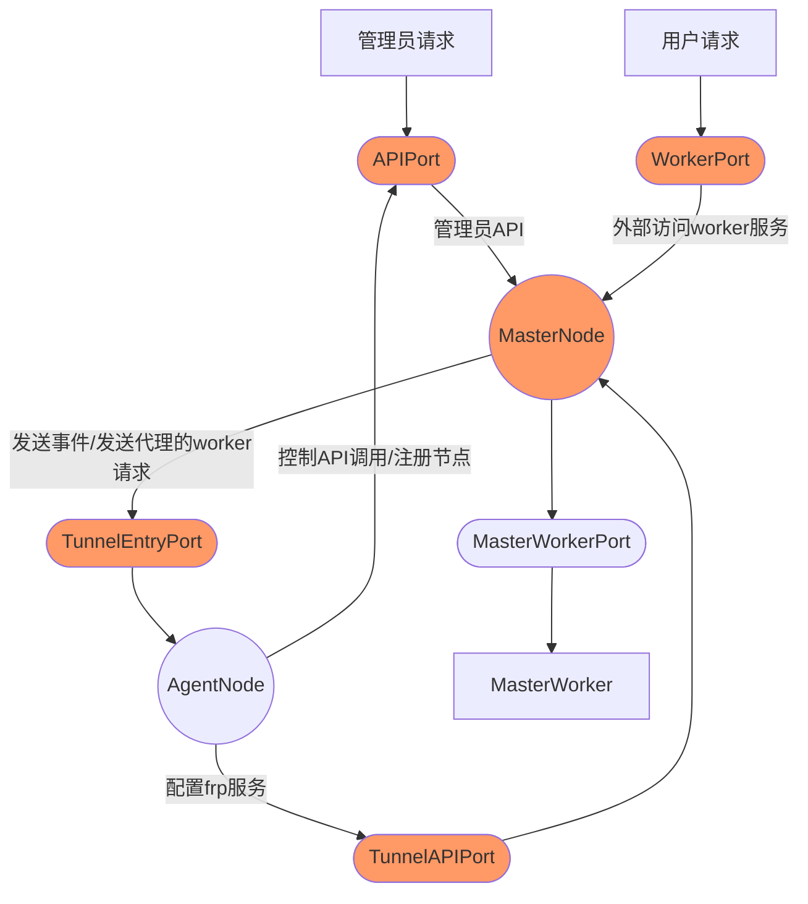

```mermaid
graph TD
    A([APIPort]):::masterColor --> |管理员API| E
    B([WorkerPort]):::masterColor --> |外部访问worker服务| E
    E --> |发送事件/发送代理的worker请求| C([TunnelEntryPort]):::masterColor --> F
    D([TunnelAPIPort]):::masterColor
    E((MasterNode)):::masterColor
    F((AgentNode)) --> |控制API调用/注册节点| A
    E --> H --> G[MasterWorker]
    H([MasterWorkerPort])
    F --> |配置frp服务| D --> E

    J[用户请求] --> B
    K[管理员请求] --> A

    classDef masterColor fill:#f96
```

当组网时，主节点需要向子节点公开`API Port` 与 `Tunnel API Port`。
并且保持`WorkerURLSuffix` 与 `AgentSecret` 一致。
子节点需要有唯一的`NodeName`。